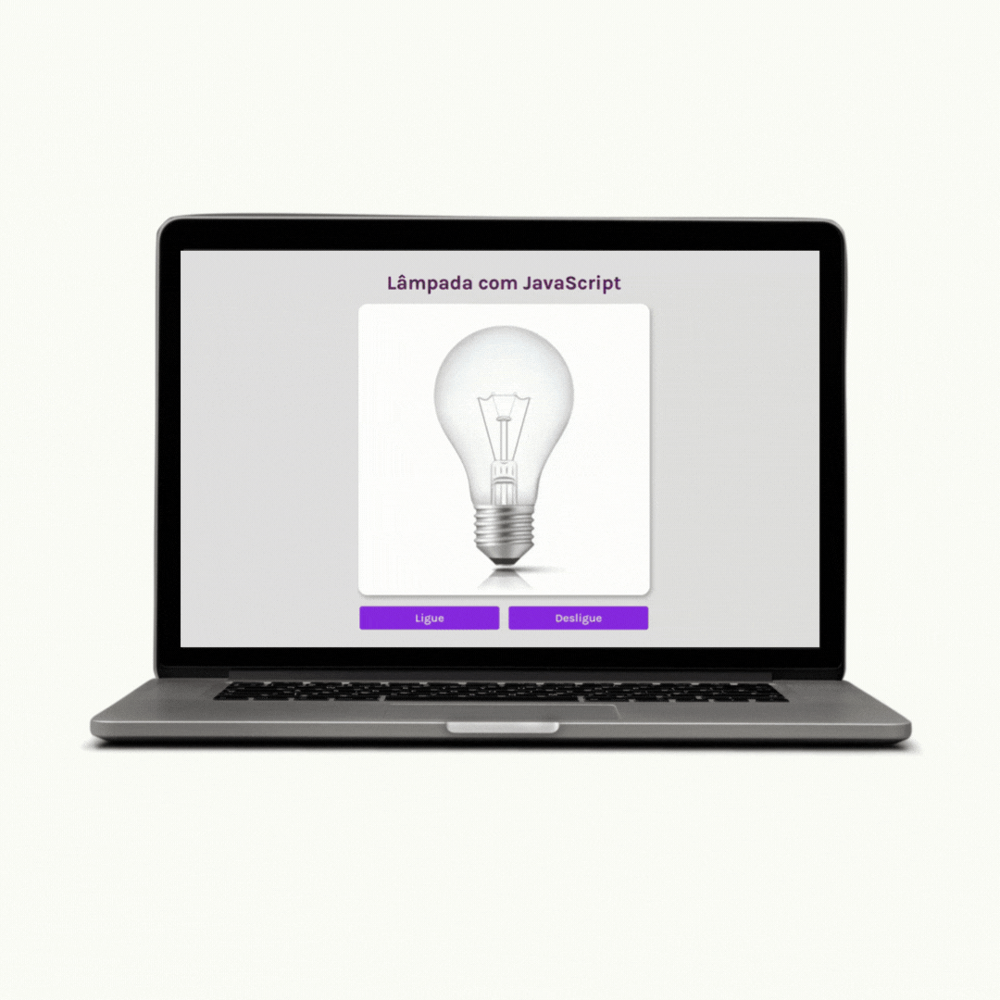

# Lâmpada 💡
- Projeto desenvolvido após assistir algumas aulas do Curso de JavaScript do Professor Guanabara!

## 🔨 Tecnologias Utilizadas
- HTML5
- CSS3
- JAVASCRIPT

## 🚀 Instruções de Uso

1. Clone o repositório para o seu ambiente local.
2. Abra o arquivo `index.html` em um navegador web moderno.
3. Explore as informações contidas e passe o cursor por cima dos botões - Ligue e Desligue.

## 📸 Capturas de Tela
- Versão Mobile

- Versão Desktop

## 🤝 Contribuição
Contribuições são bem-vindas! Se você quiser melhorar o código, siga estas etapas:

1. Fork o repositório
2. Crie uma nova branch: git checkout -b feature/nova-funcionalidade
3. Faça suas alterações e commit: git commit -m 'Adiciona nova funcionalidade'
4. Push para a branch: git push origin feature/nova-funcionalidade
5. Abra um Pull Request e descreva suas alterações.

## 📝 Licença
Este projeto está licenciado sob a Licença MIT.

----

Feito com ❤️ por João Vitor
